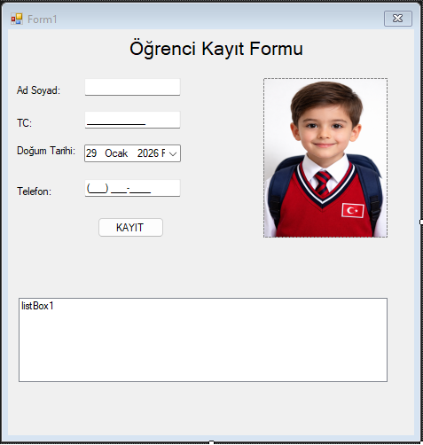

# Student Registration Form (Windows Forms)

A simple Windows Forms application that collects student information and displays the records in a ListBox.

## Features
- Full name input (letters only)
- National ID input using MaskedTextBox
- Birth date selection using DateTimePicker
- Phone number input using MaskedTextBox
- Adds entered data to a ListBox by clicking the Register button

## Technologies
- C#
- .NET Framework
- Windows Forms

## Screenshot

